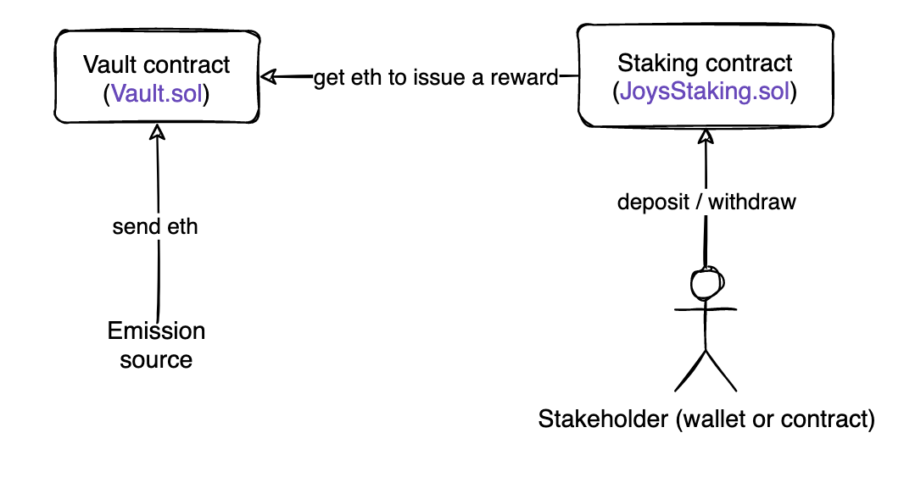

# Joys staking contract

[](https://github.com/Joys-digital/staking-contract/actions/workflows/testing.yaml)
[](https://codecov.io/gh/Joys-digital/staking-contract)
[](https://joys-digital.github.io/staking-contract/)

**Smart contract for staking native tokens**

- Lang: Solidity v0.6.12

- Project framework: truffle v5.3.14 (core: 5.3.14)

- Nodejs: v14.17.0

## Overview

### Deployed

- Joys Digital Testnet: ```0x6b371524c7168ed33A3F44f37117B307D78703c2```
- Joys Digital Mainnet: ```0x1996EAf7ffC6B70603606E1d6059F4e11Ee9E6d9```

Staking Dapp: https://staking.joys.digital/

### Documentation

- [Generated html documentation](https://joys-digital.github.io/staking-contract/)

### Project structure:

```
contracts
├── interfaces
│   ├── IJoysStaking.sol
│   ├── IStakeholder.sol
│   ├── IStakingMechanics.sol
│   └── IVault.sol
├── main
│   ├── JoysStaking.sol
│   ├── Stakeholder.sol
│   ├── StakingMechanics.sol
│   └── Vault.sol
├── mocks
│   └── StakeholderMock.sol
└── utils
    └── StakingOwnable.sol
```

- __interfaces/__ - Interfaces for compatibility with other smart contracts

- __main/__ - Main contracts

- __utils/__ - Auxiliary contacts

### How it works



## Installation & Usage

1. Install truffle

2. Install all packages
```
npm i --save-dev
```

### Build project:

```
npm run build
```

### Testing

```
npm test
```

### Test coverage

```
npm run coverage
```

### Run linters

```
npm run lint
```

### Deploy

edit network in ```truffle-config.js```
```
truffle migrate --f 2 --network <network name>
```

## License

[MIT License](./LICENSE)
